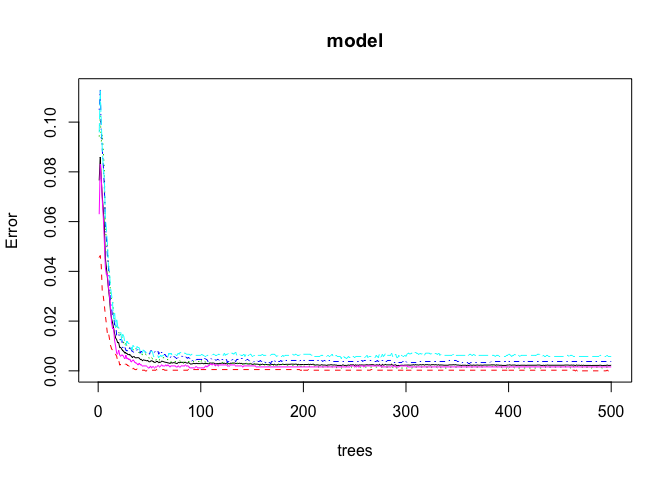
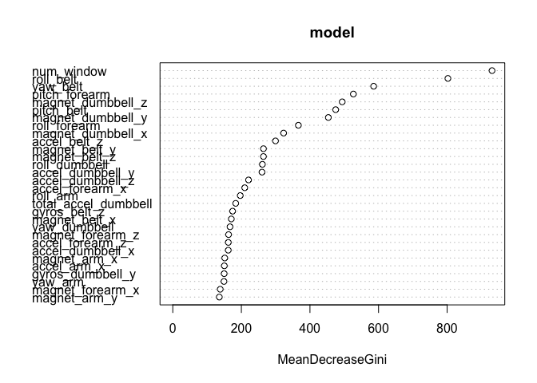

## Introduction
In this project, your will be to use data from accelerometers on the belt, forearm, arm, and dumbell of 6 participants. They were asked to perform barbell lifts correctly and incorrectly in 5 different ways:  
- exactly according to the specification (Class A),  
- throwing the elbows to the front (Class B),  
- lifting the dumbbell only halfway (Class C),  
- lowering the dumbbell only halfway (Class D),  
- throwing the hips to the front (Class E).    
The goal of your project is to predict the manner (he "classe" variable in the training set) in which they did the exercise. 


```r
setwd("~/Desktop/Exercises/Course8")
if (!file.exists("./training.csv")) {
    download.file(url = "https://d396qusza40orc.cloudfront.net/predmachlearn/pml-training.csv", destfile = "./training.csv")
}
training <-read.csv("training.csv", na.strings = c("NA", "#DIV/0!", ""))
if (!file.exists("./testing.csv")) {
    download.file(url = "https://d396qusza40orc.cloudfront.net/predmachlearn/pml-testing.csv" , destfile = "./testing.csv")
}
testing <- read.csv("testing.csv", na.strings = c("NA", "#DIV/0!", ""))
```
There are 19622 observations in the training set and 20 observations in the testing set.

We can do some cleaning to remove variables that contain mostly NA values in the training set and remove some of the variables that are not candidate predictors.

```r
removeNA<-function(df){
    numRows<-nrow(df)
    rawDF<-is.na(df)
    removeCol<-which(colSums(rawDF)>numRows * 0.5)
    
    if(length(removeCol)>0){
        colNames<-names(removeCol)
        df<-df[, !(names(df) %in% colNames)]
    }
    df
}

training<-removeNA(training)
testing<-removeNA(testing)

excludeCol<-c("X", "user_name", "raw_timestamp_part_1", "raw_timestamp_part_2", "cvtd_timestamp", "new_window")
removeCol<-function(df, excludeCol){
    df<-df[, !names(df) %in% excludeCol]
    df
}
training<-removeCol(training, excludeCol)
testing<-removeCol(testing, excludeCol)

# statisticsPattern<-"kurtosis_|skewness_|max_|min_|amplitude_|avg_|stddev_|var_"
# removeCol2<-function(df, statisticsPattern){
#     df<-df[, -grep(statisticsPattern, colnames(df))]
#     df
# }
# trainig<-removeCol2(training, statisticsPattern)
# testing<-removeCol2(testing, statisticsPattern)
```

We can take a look at the rough distribution of classe variable in the training set:

```r
table(training$classe)
```

```
## 
##    A    B    C    D    E 
## 5580 3797 3422 3216 3607
```

## Analysis

We use 70% data in the training set to build model and use the remaining 30% to do cross validation.

```r
library(caret)
set.seed(1234)
inTrain<-createDataPartition(y=training$classe, p=0.7, list=FALSE)
subTraining<-training[inTrain,]
subTesting<-training[-inTrain,]
```

We can use Random Forest Model to do the prediction.

```r
library(randomForest)
set.seed(12345)
model<-randomForest(classe ~., data=subTraining, method = "class")
model
```

```
## 
## Call:
##  randomForest(formula = classe ~ ., data = subTraining, method = "class") 
##                Type of random forest: classification
##                      Number of trees: 500
## No. of variables tried at each split: 7
## 
##         OOB estimate of  error rate: 0.23%
## Confusion matrix:
##      A    B    C    D    E  class.error
## A 3905    0    0    0    1 0.0002560164
## B    2 2654    2    0    0 0.0015048909
## C    0    8 2387    1    0 0.0037562604
## D    0    0   12 2239    1 0.0057726465
## E    0    0    0    4 2521 0.0015841584
```

```r
plot(model)
```

<!-- -->


```r
pred<-predict(model, subTesting, type="class")
confusionMatrix(pred, subTesting$classe)
```

```
## Confusion Matrix and Statistics
## 
##           Reference
## Prediction    A    B    C    D    E
##          A 1674    3    0    0    0
##          B    0 1135    4    0    0
##          C    0    1 1022    4    0
##          D    0    0    0  960    0
##          E    0    0    0    0 1082
## 
## Overall Statistics
##                                           
##                Accuracy : 0.998           
##                  95% CI : (0.9964, 0.9989)
##     No Information Rate : 0.2845          
##     P-Value [Acc > NIR] : < 2.2e-16       
##                                           
##                   Kappa : 0.9974          
##                                           
##  Mcnemar's Test P-Value : NA              
## 
## Statistics by Class:
## 
##                      Class: A Class: B Class: C Class: D Class: E
## Sensitivity            1.0000   0.9965   0.9961   0.9959   1.0000
## Specificity            0.9993   0.9992   0.9990   1.0000   1.0000
## Pos Pred Value         0.9982   0.9965   0.9951   1.0000   1.0000
## Neg Pred Value         1.0000   0.9992   0.9992   0.9992   1.0000
## Prevalence             0.2845   0.1935   0.1743   0.1638   0.1839
## Detection Rate         0.2845   0.1929   0.1737   0.1631   0.1839
## Detection Prevalence   0.2850   0.1935   0.1745   0.1631   0.1839
## Balanced Accuracy      0.9996   0.9978   0.9975   0.9979   1.0000
```
As can be seen above, the model overall accuracy is 0.9979609 in the validation set. We can also plot the variable importance.


```r
varImpPlot(model)
```

<!-- -->

## Results
Then we apply this model to the testing set.

```r
pred_final<-predict(model, testing, type="class")
pred_final
```

```
##  1  2  3  4  5  6  7  8  9 10 11 12 13 14 15 16 17 18 19 20 
##  B  A  B  A  A  E  D  B  A  A  B  C  B  A  E  E  A  B  B  B 
## Levels: A B C D E
```


